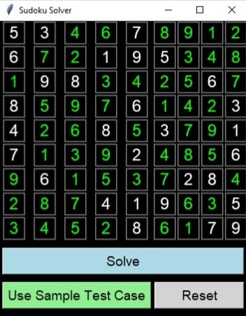

# Sudoku Solver

A simple GUI-based Sudoku solver built using Python and Tkinter.

## Features
- Interactive GUI using Tkinter
- Solves puzzles using backtracking algorithm
- Differentiates user inputs and solver-filled values by color

## Requirements
- Python 3.x
- Tkinter (comes with standard Python installation)


## Screenshot


## How to Run

```bash
python sudoku_solver.py


